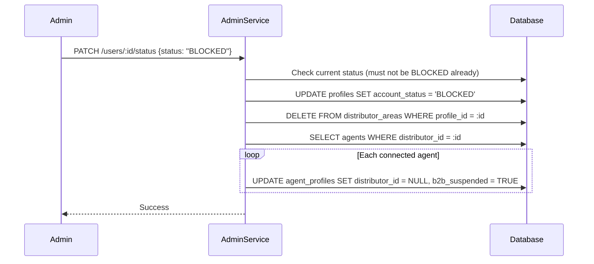
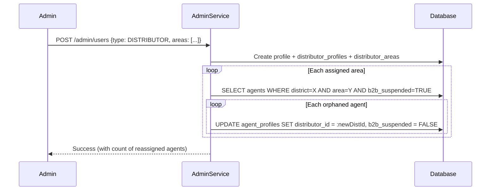

# Account Status Management Overhaul

## Current State (Bugs and Issues)

- **Status is scattered across 5 subtype tables** (`customer_profiles`, `agent_profiles`, `merchant_profiles`, `distributor_profiles`, `biller_profiles`), each with its own `status` column. The `profiles` table has no `account_status`.
- **Bug in `getAccountStatus`**: In [profileModel.js](server/src/models/profileModel.js) line 276, the `AGENT` key correctly maps to `agent_profiles` now, but the old code in `authService.login` reads status from subtype -- this whole approach is fragile.
- **No timed suspension**: Suspend sets `status = 'SUSPENDED'` permanently with no duration. The `locked_until` column on `profiles` is only used for PIN lockout.
- **Blocked accounts can still log in**: Login in [authService.js](server/src/services/authService.js) returns `accountStatus` but never rejects SUSPENDED/BLOCKED users.
- **Blocking a distributor does not free areas**: `distributor_areas` rows stay, so `isAreaTaken` and `listAreasByDistrict` still mark those areas as taken.
- **Blocking a distributor does not suspend B2B for connected agents**: No logic exists for this.
- **No phone verification check during agent approval**: When activating an agent, the code finds a distributor for the area but never checks `is_phone_verified` on that distributor's profile.
- **Distributor detail page shows the Suspend button**: It shouldn't (per requirement #4).

---

## Architecture Decisions

### 1. Move `account_status` to `profiles` table

Add an `account_status profile_status NOT NULL` column (no default -- the backend sets it explicitly at creation time) and a `suspended_until TIMESTAMPTZ` column directly on `profiles`. Keep the subtype `status` columns but stop using them for access-control decisions -- they become legacy/informational. All reads/writes for account status go through `profiles.account_status`. This is cleaner and avoids the table-map lookup pattern.

**Status at creation time (set by backend, not by DB default):**

- CUSTOMER, DISTRIBUTOR, BILLER: `account_status = 'ACTIVE'`
- AGENT, MERCHANT: `account_status = 'PENDING_KYC'`

The `profileModel.create` function and the admin `createProfile` service will be updated to accept and set the initial `account_status` value explicitly.

**We will NOT reuse `locked_until`** for suspension. `locked_until` is PIN-lockout (auto-clears on successful login). Suspension is an admin action with different semantics. A new `suspended_until` column keeps concerns separated.

### 2. Timed suspension UI

Build a `SuspendDurationModal` component inspired by the Telegram-style screenshots you provided. Preset buttons: 1 day, 2 days, 3 days, 1 week, 2 weeks, 1 month, 2 months, 3 months. Plus a "Custom" option that reveals day/hour/minute number inputs. On confirm, send `{ status: "SUSPENDED", suspendedUntil: <ISO timestamp> }` to the API. We will build this as a new component since the existing `ConfirmationModal` is too simple for this interaction.

### 3. Blocked = permanent; Suspended = revocable + timed

- BLOCKED: permanent, no status change possible from admin panel (only a direct DB fix). When rendering status action buttons, if `currentStatus === 'BLOCKED'`, show no action buttons at all.
- SUSPENDED: admin can click "Activate Account" to revoke early. A background job or login-time check auto-activates when `suspended_until` has passed.

### 4. Distributor block releases areas and suspends agent B2B

- On BLOCK of a distributor: delete their `distributor_areas` rows + set `agent_profiles.distributor_id = NULL` for connected agents + set those agents' `account_status` to a B2B-suspended state (we'll use a flag `b2b_suspended BOOLEAN DEFAULT FALSE` on `agent_profiles`).
- For distributors, the admin UI hides the "Suspend" button entirely -- only "Block" is shown.
- When agents with `distributor_id = NULL` (or `b2b_suspended = TRUE`) try B2B, show a clear message: "Your distributor account has been blocked. B2B transfers are temporarily unavailable until a new distributor is assigned to your area."

### 5. New distributor auto-assigns orphaned agents

When a new distributor is created for an area, query `agent_profiles` for agents in that area with `distributor_id IS NULL` (or b2b_suspended), assign them to the new distributor, and clear `b2b_suspended`.

### 6. Login rejection for SUSPENDED/BLOCKED

In `authService.login`, after PIN validation, check `account_status`:

- SUSPENDED: if `suspended_until` is in the past, auto-activate and proceed. Otherwise reject with message including remaining time.
- BLOCKED: reject with "Your account has been permanently blocked. Contact support."

### 7. Agent approval requires distributor phone verification

In `adminService.updateUserStatus` when activating an agent, after finding the distributor, check `profiles.is_phone_verified` for that distributor. If not verified, reject with a clear error.

---

## File Changes

### New migration: `server/migrations/017_account_status_on_profiles.sql`

```sql
-- Step 1: Add column as nullable first (to allow backfill before enforcing NOT NULL)
ALTER TABLE profiles ADD COLUMN IF NOT EXISTS account_status profile_status;
ALTER TABLE profiles ADD COLUMN IF NOT EXISTS suspended_until TIMESTAMPTZ;
ALTER TABLE agent_profiles ADD COLUMN IF NOT EXISTS b2b_suspended BOOLEAN DEFAULT FALSE;

-- Step 2: Backfill from subtype tables
UPDATE profiles p SET account_status = sub.status FROM customer_profiles sub WHERE sub.profile_id = p.profile_id;
UPDATE profiles p SET account_status = sub.status FROM agent_profiles sub WHERE sub.profile_id = p.profile_id;
UPDATE profiles p SET account_status = sub.status FROM merchant_profiles sub WHERE sub.profile_id = p.profile_id;
UPDATE profiles p SET account_status = sub.status FROM distributor_profiles sub WHERE sub.profile_id = p.profile_id;
UPDATE profiles p SET account_status = sub.status FROM biller_profiles sub WHERE sub.profile_id = p.profile_id;

-- Step 3: Set SYSTEM profiles to ACTIVE (they have no subtype row)
UPDATE profiles SET account_status = 'ACTIVE' WHERE account_status IS NULL;

-- Step 4: Now enforce NOT NULL (no default -- backend sets it explicitly per role)
ALTER TABLE profiles ALTER COLUMN account_status SET NOT NULL;
```

**No DB default is set.** The backend is responsible for choosing the correct initial status:

- `profileModel.create` gains an `accountStatus` parameter.
- Customer/Distributor/Biller creation passes `'ACTIVE'`.
- Agent/Merchant creation passes `'PENDING_KYC'`.

Update [master.sql](server/migrations/master.sql) to include `017`.

### Server changes

**[profileModel.js](server/src/models/profileModel.js)**

- Update `create()` to accept and INSERT an `accountStatus` parameter (no DB default; caller must provide it).
- Rewrite `getAccountStatus` to read from `profiles.account_status`.
- Add `updateAccountStatus(profileId, status, suspendedUntil, client)`.
- Add `clearSuspension(profileId, client)`.
- Add `getOrphanedAgentsByArea(district, area, client)` to find agents needing reassignment.
- Add `suspendAgentB2B(agentProfileId, client)` / `unsuspendAgentB2B(agentProfileId, client)`.

**[adminService.js](server/src/services/adminService.js) `updateUserStatus`**

- Write to `profiles.account_status` (+ `suspended_until` for SUSPENDED).
- If BLOCKED and type is DISTRIBUTOR: delete from `distributor_areas`, set connected agents' `distributor_id = NULL` and `b2b_suspended = TRUE`.
- If BLOCKED: disallow further status changes (check current status first, reject if already BLOCKED).
- If ACTIVE and type is AGENT: check distributor's `is_phone_verified`.
- If creating a new distributor (`createProfile`): auto-assign orphaned agents in those areas and clear `b2b_suspended`.

**[adminValidation.js](server/src/validations/adminValidation.js)**

- Update `updateStatusSchema` to accept optional `suspendedUntil` (ISO string) when status is SUSPENDED.

**[authService.js](server/src/services/authService.js) `login`**

- After PIN validation, read `profiles.account_status` and `profiles.suspended_until`.
- If SUSPENDED and `suspended_until` is past: auto-clear to ACTIVE and proceed.
- If SUSPENDED and still active: reject with time remaining.
- If BLOCKED: reject with permanent block message.

**[locationModel.js](server/src/models/locationModel.js)**

- Update `isAreaTaken` and `listAreasByDistrict` to JOIN `distributor_profiles` and only consider areas where the distributor's `profiles.account_status` is not BLOCKED. (Or simpler: since blocking deletes `distributor_areas` rows, these queries automatically become correct after the BLOCK action.)

**[transactionService.js](server/src/services/transactionService.js)**

- In B2B flow, when agent loads distributor: if `distributor_id IS NULL` or `b2b_suspended = TRUE`, return a specific error message about distributor being unavailable.

### Client changes

**New component: `client/src/components/admin/SuspendDurationModal.jsx`**

- Telegram-style duration picker modal.
- Preset buttons: 1d, 2d, 3d, 1w, 2w, 1m, 2m, 3m.
- "Custom" toggle with day/hour/minute number inputs.
- Cancel / Mute (Suspend) buttons at the bottom.
- Returns an ISO timestamp (`suspendedUntil`) on confirm.

**[UserDetailPage.jsx](client/src/pages/admin/UserDetailPage.jsx)**

- For DISTRIBUTOR: filter out the "Suspend" action, only show "Block" (and "Activate" if currently not blocked).
- For BLOCKED accounts: show no status change buttons at all (with a note "This account is permanently blocked").
- When "Suspend" is clicked: open `SuspendDurationModal` instead of `ConfirmationModal`.
- Update `confirmStatusChange` to pass `suspendedUntil` to the API.
- When "Block" is clicked: show a strong warning in the confirmation modal that this is irreversible.

**[adminApi.js](client/src/api/adminApi.js)**

- Update `updateUserStatus` to accept an optional `suspendedUntil` parameter.

**[LoginPage.jsx](client/src/pages/auth/LoginPage.jsx)**

- Handle error responses for SUSPENDED (show remaining time) and BLOCKED (show permanent block message) with distinct UI treatment.

**[B2BTransferPage.jsx](client/src/pages/transactions/B2BTransferPage.jsx)**

- When loading distributor fails with a b2b-suspended error, show an informative message instead of a generic toast: "Your distributor has been blocked. B2B transfers are unavailable until a new distributor is assigned to your area."

---

## Data Flow: Blocking a Distributor



## Data Flow: New Distributor Assignment (auto-reassign)


